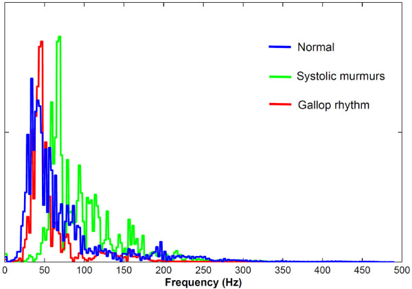
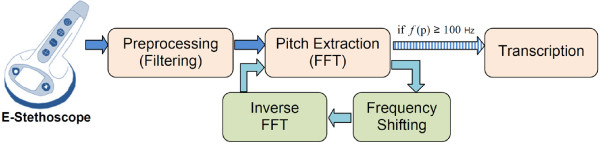
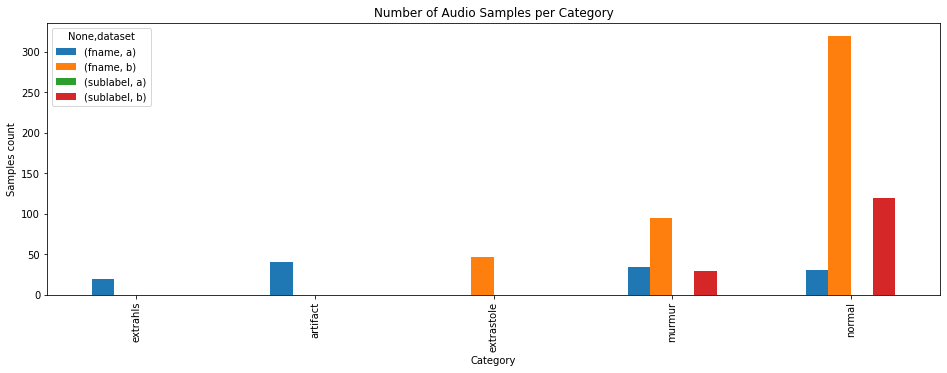

# Heartbeat Classification

As seen in the ggraph below, heart sound frequencies oscillate between 10Hz and 300Hz. 

However, in the case of aortic regurgitacion the frequency can be higher than 400Hz. 

The dataset is divided into two sets. Set_a comes from iSthethoscope app; set_b comes from DigiScope. 
After getting these sounds we can preprocess (filter) then to remove the frequencies that are not in a (1,500)Hz interval since those kind of noises are not produced by the heart. 

# Unbalanced classes problem:
As seen in the picture below, the different classes are not balanced. 

In order to fix this problem, we can perform a class weight but, would it really make sense?

In the one hand, if we weight the classes, we are saying that the probability of having an abnormal heartbeat is the same from having a healthy heart, which is not true. We would find more false negative (normal beats classified as abnormal beats). 

On the other hand, if we don't weight the classes whenever the NN is confused, it will diagnose a normal beat since its propability is bigger. we would find false positive (abnormal beats classfied as normal beats).

Since in this case it is preferable to find false negatives instead of false positives, we will not weight the classes.

# Want to test your heart?
* Go to the folder `inputsound/my_set/` and upload your .wav audios. 

* Then, after running every cell in the Neural_Network notebook, you will see a title that sais "LOADING MY OWN DATA".

* Insert the path for your audio file and get your 
diagnosis (don't panic if it is not normal, this is not a doctor).

# References:
* [Agricultural and biological sciences heart sounds.](https://www.sciencedirect.com/topics/agricultural-and-biological-sciences/heart-sounds#:~:text=Although%20the%20human%20ear%20can,from%2020%20to%20500%20Hz)

* Article: [the frequency of heart.](https://www.ncbi.nlm.nih.gov/pmc/articles/PMC3396354/#:~:text=Moreover%2C%20the%20frequency%20of%20heart,of%20a%20normal%20heart%20sound.)