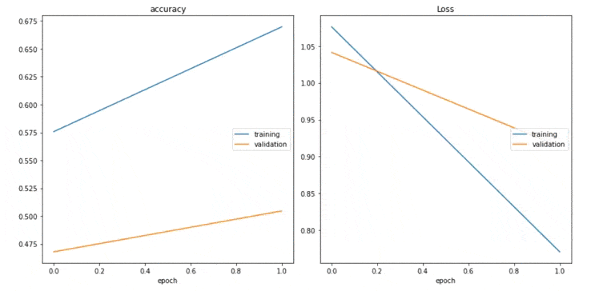

# Heartbeat Classification
This project aims to find heart anomalies in a heartbeat recording. To do so, we will train a neural network that learns to classify these heartbeats as normal, murmur, or extrasystole.

The best accuracy obtained was 78.9%, which was achieved by using a convolutional neural network.

Kaggle dataset: [Heartbeat Sounds](https://www.kaggle.com/kinguistics/heartbeat-sounds/notebooks?datasetId=453&sortBy=voteCount)

## Project Structure:
The **output folder** contains both, the best LSTM and CNN model that was obtained.
Five different notebooks can be found:

-	The first one is a short analysis of the dataset to understand what kind of data we have.
-	In the second notebook, we perform different frequency analysis of the recording: FFT, STFT, and MFCC.
-	We can also find a notebook for the LSTM and CNN.
-	The notebook that says “MoreSamples”, contains a CNN model where all the audios were shorted to 4 seconds to have more input data.
-	Finally, the predictions.

## Frequency study:
As seen in the graph below, heart sound frequencies oscillate between 10Hz and 300Hz. 
In the case of aortic regurgitation, the frequency can be higher than 400Hz, but let’s assume that people that recorded these heartbeats with their phones were not in such drastic conditions. 
That said, we will filter the audios with a LPF at at fc = 300Hz.

## Considerations:
### Unbalanced classes problem:
As seen in the picture below, the different classes are not balanced. 

To fix this problem, we can perform a class_weight but, would it really make sense?

On the one hand, if we weight the classes, we are saying that the probability of having an abnormal heartbeat is the same as having a healthy heart, which is not true. We would find more normal beats classified as abnormal beats. 

On the other hand, if we don't weight the classes, whenever the NN is confused, it will diagnose a normal beat since its probability is bigger. We would find more abnormal beats classified as normal beats.

We should have this in mind because if we don't weight the classes, we are being honest with reality, but also, the risk of not finding an abnormal beat is bigger.

### Artifacts:
In order to make better predictions, we have not included the artifact sounds(
friction with clothes for example) in our model. 

So please, be aware of this before you upload your audio file. If it is too noisy, your diagnose won't be good.

# Want to test your heart?
* Go to the folder `inputsound/my_set/` and upload your .wav audios. 

* Then, navigate to "LOADING MY OWN DATA" in the notebook named "5_Predictions".

* Insert the path for your audio file and get your 
diagnosis (don't panic if it is not normal, this is not a doctor).

# References:
* [Agricultural and biological sciences heart sounds.](https://www.sciencedirect.com/topics/agricultural-and-biological-sciences/heart-sounds#:~:text=Although%20the%20human%20ear%20can,from%2020%20to%20500%20Hz)

* Article: [the frequency of heart.](https://www.ncbi.nlm.nih.gov/pmc/articles/PMC3396354/#:~:text=Moreover%2C%20the%20frequency%20of%20heart,of%20a%20normal%20heart%20sound.)